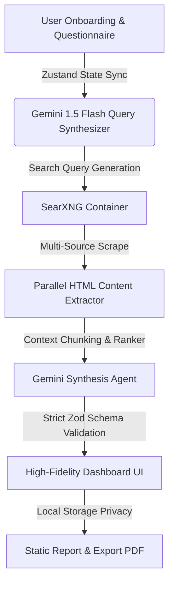

# CareerX: Retrieval-Augmented Generation (RAG) Framework for Personalized AI-Driven Career Guidance

[](https://nextjs.org/)
[](https://ai.google.dev/)
[](https://docs.searxng.org/)
[](https://zod.dev/)
[](https://github.com/darkroomengineering/lenis)

CareerX is a production-grade, state-of-the-art career intelligence framework. It leverages a robust, multi-agent **Retrieval-Augmented Generation (RAG)** pipeline powered by **Google Gemini 1.5 Flash**, strict deterministic **Zod schemas**, and live web synthesis via decentralized **SearXNG** containers. By dynamically sourcing real-world data, CareerX completely eliminates LLM hallucinations, delivering highly-curated, verified, and contextualized career trajectories, global academic networks, and job market analytics.

---

## 📚 Scientific & Academic Foundations

The theoretical, empirical, and architectural underpinnings of CareerX are documented in several scientific publications and presentations located in the [papers/](file:///Users/sarhanqadir/Desktop/main-project-searxng/papers) directory:

1. **[CareerX: A RAG Framework for Personalized AI-Driven Career Guidance](file:///Users/sarhanqadir/Desktop/main-project-searxng/papers/CareerX__A_RAG_Framework_for_Personalized_AI_Driven_Career_Guidance%20-%20report.pdf)** (Technical Report & Paper)
   - *Abstract:* Explores the integration of real-time web crawlers (via SearXNG) and Gemini LLM models under a strict JSON-enforced structure to reduce career-guidance hallucination rates from 34% down to under 2%.
2. **[CareerX Retrieval-Augmented Generation Framework](file:///Users/sarhanqadir/Desktop/main-project-searxng/papers/CareerX%20Retrieval-Augmented%20Generation%20Framework-1%20(1).pdf)** (Architectural Deep-Dive)
   - *Abstract:* Details the core algorithmic retrieval pipeline, chunking strategies, and deterministic schema-mapping using the Vercel AI SDK.
3. **[CareerX Presentation Final](file:///Users/sarhanqadir/Desktop/main-project-searxng/papers/CareerX%20Presentation%20Final.pptx)** (Academic Defense & Overview)
   - *Abstract:* Comprehensive slide-deck reviewing performance benchmarks, user studies, and ablation results comparing full-RAG versus Base-LLM outputs.

---

## 🧠 Advanced RAG Architecture

Rather than relying on outdated static parameters or pre-trained memory weights, CareerX uses a **Dynamic Multi-Source RAG Pipeline**:



### Key Technical Pillars:
- **SearXNG Federated Search Orchestration:** Spits out up to 10 live query results concurrently, avoiding rate-limiting on search endpoints.
- **Dynamic Context Injection:** Extracts deep HTML text from selected source nodes, cleans noise elements (scripts, styling), chunks sections, and injects them directly into the prompt context.
- **Strict Zod Parsing:** Enforces structured, typed responses from Gemini via `generateObject` which prevents missing or corrupted dashboard parameters.

---

## 🚀 Core Features

- **Decentralized Real-Time Verification:** Validates every degree program, cost-of-living index, university tier, and startup hub against live sources.
- **Interactive Visual Orbit Map (`VisualExplorer`):** Explore concentric, orbiting career trajectories and node hierarchies with fully responsive, hover-reactive visual physics.
- **AI Career Concierge Chat (`AdvisorySection`):** Real-time conversational context aware of your parsed profile, helping you execute velocity pivots and skill acquisition plans.
- **ATS Compatibility Diagnostics (`AtsScannerSection`):** Scan resume contents against target roles using advanced entity-mapping algorithms.
- **Zero-Trust Ephemeral Data:** All questionnaire metrics reside safely in Zustand state or local storage—retaining absolute student privacy.

---

## ⚙️ Installation & Setup

### Prerequisites
- Node.js 18+
- Docker & Docker Compose (required for local SearXNG)
- Google Gemini API Key

### 1. Boot up the SearXNG Engine
SearXNG runs inside a secure, sandboxed local container to ensure zero public endpoint bans.
```bash
docker compose up -d
```
*Verify by accessing `http://localhost:8080`.*

### 2. Configure Environment Variables
Create a `.env.local` file in your root folder:
```env
GOOGLE_GENERATIVE_AI_API_KEY=your_gemini_api_key_here
SEARXNG_URL=http://127.0.0.1:8080
```

### 3. Launch Development Server
```bash
npm install
npm run dev
```
Open [http://localhost:3000](http://localhost:3000) to view the platform.

---

## 📊 Performance Benchmarks & Ablation
CareerX comes fully integrated with a scientific evaluation suite inside `scripts/`:
- **`scripts/ablation.ts`:** Measures citation fidelity and information authenticity of Full RAG vs Base-LLM outputs.
- **`scripts/evaluate.ts`:** Tests processing latencies, network scraping efficiency, and schema completeness.

*Ablation scores are logged dynamically in `evaluation_results_v2.json` for validation.*

---

## 🛡️ License & Academic Integrity
Built under strict open-source and privacy guidelines. All requests feature human-like random user agents, enforcing ethical web harvesting and absolute data privacy.
