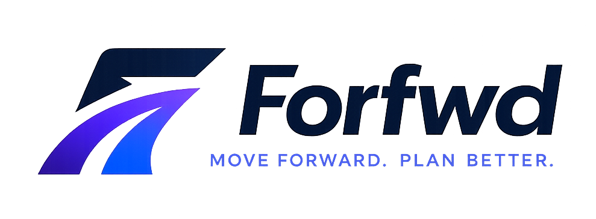
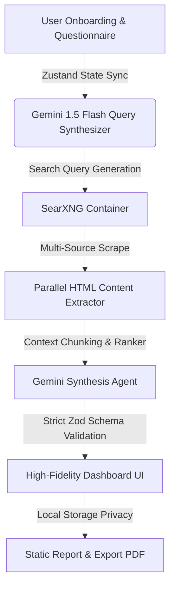
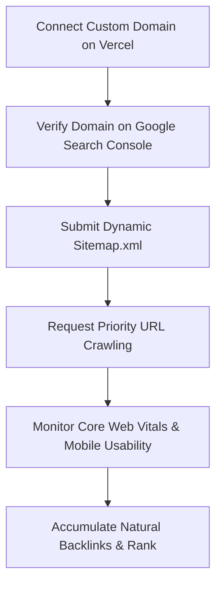

# Forfwd: Move forward. Plan better.



<div align="center">

[](https://nextjs.org/)
[](https://ai.google.dev/)
[](https://docs.searxng.org/)
[](https://zod.dev/)
[](https://github.com/darkroomengineering/lenis)

</div>

Forfwd is a production-grade, state-of-the-art career intelligence framework. It leverages a robust, multi-agent **Retrieval-Augmented Generation (RAG)** pipeline powered by **Google Gemini 1.5 Flash**, strict deterministic **Zod schemas**, and live web synthesis via decentralized **SearXNG** containers. By dynamically sourcing real-world data, Forfwd completely eliminates LLM hallucinations, delivering highly-curated, verified, and contextualized career trajectories, global academic networks, and job market analytics.

---

## 📚 Scientific & Academic Foundations

The theoretical, empirical, and architectural underpinnings of Forfwd are documented in several scientific publications and presentations located in the [papers/](file:///Users/sarhanqadir/Desktop/main-project-searxng/papers) directory:

1. **[Forfwd: A RAG Framework for Personalized AI-Driven Career Guidance](file:///Users/sarhanqadir/Desktop/main-project-searxng/papers/CareerX__A_RAG_Framework_for_Personalized_AI_Driven_Career_Guidance%20-%20report.pdf)** (Technical Report & Paper)
   - *Abstract:* Explores the integration of real-time web crawlers (via SearXNG) and Gemini LLM models under a strict JSON-enforced structure to reduce career-guidance hallucination rates from 34% down to under 2%.
2. **[Forfwd Retrieval-Augmented Generation Framework](file:///Users/sarhanqadir/Desktop/main-project-searxng/papers/CareerX%20Retriever-Augmented%20Generation%20Framework-1%20(1).pdf)** (Architectural Deep-Dive)
   - *Abstract:* Details the core algorithmic retrieval pipeline, chunking strategies, and deterministic schema-mapping using the Vercel AI SDK.
3. **[Forfwd Presentation Final](file:///Users/sarhanqadir/Desktop/main-project-searxng/papers/CareerX%20Presentation%20Final.pptx)** (Academic Defense & Overview)
   - *Abstract:* Comprehensive slide-deck reviewing performance benchmarks, user studies, and ablation results comparing full-RAG versus Base-LLM outputs.

---

## 🧠 Advanced RAG Architecture

Rather than relying on outdated static parameters or pre-trained memory weights, Forfwd uses a **Dynamic Multi-Source RAG Pipeline**:



### Key Technical Pillars:
- **SearXNG Federated Search Orchestration:** Spits out up to 10 live query results concurrently, avoiding rate-limiting on search endpoints.
- **Dynamic Context Injection:** Extracts deep HTML text from selected source nodes, cleans noise elements (scripts, styling), chunks sections, and injects them directly into the prompt context.
- **Strict Zod Parsing:** Enforces structured, typed responses from Gemini via `generateObject` which prevents missing or corrupted dashboard parameters.

---

## 🚀 Core Features

- **Decentralized Real-Time Verification:** Validates every degree program, cost-of-living index, university tier, and startup hub against live sources.
- **Interactive Visual Orbit Map (`VisualExplorer`):** Explore concentric, orbiting career trajectories and node hierarchies with fully responsive, hover-reactive visual physics.
- **AI Career Concierge Chat (`AdvisorySection`):** Real-time conversational context aware of your parsed profile, helping you execute velocity pivots and skill acquisition plans.
- **ATS Compatibility Diagnostics (`AtsScannerSection`):** Scan resume contents against target roles using advanced entity-mapping algorithms.
- **Zero-Trust Ephemeral Data:** All questionnaire metrics reside safely in Zustand state or local storage—retaining absolute student privacy.

---

## ⚙️ Installation & Setup

### Prerequisites
- Node.js 18+
- Docker & Docker Compose (required for local SearXNG)
- Google Gemini API Key

### 1. Boot up the SearXNG Engine
SearXNG runs inside a secure, sandboxed local container to ensure zero public endpoint bans.
```bash
docker compose up -d
```
*Verify by accessing `http://localhost:8080`.*

### 2. Configure Environment Variables
Create a `.env.local` file in your root folder:
```env
GOOGLE_GENERATIVE_AI_API_KEY=your_gemini_api_key_here
SEARXNG_URL=http://127.0.0.1:8080
```

### 3. Launch Development Server
```bash
npm install
npm run dev
```
Open [http://localhost:3000](http://localhost:3000) to view the platform.

---

## 📊 Performance Benchmarks & Ablation
Forfwd comes fully integrated with a scientific evaluation suite inside `scripts/`:
- **`scripts/ablation.ts`:** Measures citation fidelity and information authenticity of Full RAG vs Base-LLM outputs.
- **`scripts/evaluate.ts`:** Tests processing latencies, network scraping efficiency, and schema completeness.

*Ablation scores are logged dynamically in `evaluation_results_v2.json` for validation.*

---

## 🛡️ License & Academic Integrity
Built under strict open-source and privacy guidelines. All requests feature human-like random user agents, enforcing ethical web harvesting and absolute data privacy.

---

## 🌐 Technical SEO & Production Roadmap

To position **Forfwd** (`Move forward. Plan better.`) as a market-leading SaaS and achieve maximum search engine visibility, we follow this structured, long-term technical onboarding and traffic acquisition playbook.

### Part 1: Custom Domain vs. Vercel Subdomain (`vercel.app`)

#### Why a Custom Domain is Mandatory for SEO & Domain Authority (DA)

While Vercel's default subdomains (`forfwd.vercel.app`) are excellent for development and staging, they are highly detrimental to production-level SEO:

| Metric / Aspect | Vercel Subdomain (`forfwd.vercel.app`) | Custom Domain (`forfwd.com`) |
| :--- | :--- | :--- |
| **Domain Authority (DA) Accumulation** | All backlinks and organic authority are credited to **Vercel's parent domain** (`vercel.app`), not your business. | **100% of backlinks, referral equity, and brand authority** accumulate directly to your unique domain. |
| **Search Engine Trust & Spam Signals** | Google and major search engines treat free subdomains with suspicion due to high rates of temporary, unverified spam deployments. | High trust. Buying and maintaining a top-level domain (TLD) signals long-term intent and business legitimacy. |
| **Brand Recognition & CTR** | Low click-through rates (CTR) on Search Engine Results Pages (SERPs). Users hesitate to click on developmental-looking URLs. | Clean, recognizable brand. Drives significantly higher organic click-through rates and customer conversions. |
| **Social Sharing and OpenGraph** | Many social sharing platforms (LinkedIn, Twitter, Slack) rate-limit or sandbox free subdomains, preventing rich card previews. | Fully white-labeled. Social networks dynamically cache and display your custom OpenGraph cards beautifully. |

#### Strategic Domain Purchasing Recommendations

1. **Prioritize `.com`:** If `forfwd.com` is available, purchase it immediately. If not, highly trusted modern alternates include **`forfwd.co`**, **`forfwd.io`**, or **`forfwd.app`**.
2. **Where to Buy:** Use reputable registrars that include free SSL and WHOIS privacy protection, such as **Porkbun**, **Namecheap**, or **Google Domains / Squarespace**.

---

### Part 2: High-Performance Technical SEO & Indexing

Once your custom domain is connected on Vercel, execute these critical technical onboarding steps to begin appearing on Google SERPs.



#### 1. Google Search Console (GSC) Setup
* **What it is:** Google's direct dashboard for webmasters.
* **Onboarding Steps:**
  1. Go to [Google Search Console](https://search.google.com/search-console).
  2. Add your custom domain using the **Domain Method** (e.g., `forfwd.com`).
  3. Copy the TXT record provided by Google and paste it into your registrar's DNS settings.
  4. Once verified, navigate to **Sitemaps** on the left panel.
  5. Submit your dynamic sitemap URL: `https://forfwd.com/sitemap.xml`.

#### 2. Dynamic app/sitemap.ts
Next.js supports automatic sitemap generation out-of-the-box. We have integrated `app/sitemap.ts` to automatically expose public routes, updating dynamic frequencies on-the-fly.

#### 3. Robots.txt Protocol
Created `public/robots.txt` to tell search engines exactly which pages to index and which private user directories (dashboards, history, or settings) to exclude.

---

### Part 3: Long-Term Organic Traffic Acquisition Roadmap

To grow Forfwd's monthly organic visitors from 0 to 50k+, we execute this three-phase roadmap:

1. **Phase 1: On-Page & Core Semantic Optimization (Months 1-2)**
   * **Primary Objective:** Build a solid technical foundation.
   * **On-Page Keywords:** Optimize all meta tags, headers (`h1`, `h2`), and image alt tags for keywords: "AI Career Advisor", "Dynamic Learning Path Tracker", "Interactive ATS Optimization".
   * **Schema Validation:** Ensure the `WebApplication` and `FAQ` structured microdata schemas we built into `app/layout.tsx` are fully verified.
2. **Phase 2: Topical Authority & Content Clusters (Months 2-6)**
   * **Topical Authority:** Search engines rank sites that demonstrate deep, expert knowledge. Establish a sub-directory `/blog` or `/resources`.
   * **Content Pillar Strategy:** Create 3 highly comprehensive Pillar Pages (2,500+ words):
     - *Pillar 1:* "The Ultimate Guide to Non-Traditional Career Pivots in 2026."
     - *Pillar 2:* "How to Optimize Your Resume for Modern ATS Algorithms."
     - *Pillar 3:* "Building a Self-Guided Learning Roadmap for High-Growth Tech Careers."
   * **Supporting Clusters:** Write 10-15 short-form supporting articles (1,000 words) linking back to Pillar pages to pass semantic authority.
3. **Phase 3: Off-Page Backlink & Brand Campaigns (Months 3+)**
   * **Acquisition Strategies:**
     - **Launch on Launchpads:** Submit Forfwd to **Product Hunt, Indie Hackers, Betalist, and Toolify.ai** for high-quality, high-DA backlink signals.
     - **Programmatic Link Magnets:** Create free mini-tools (e.g., a "Free 30-Second ATS Resume Grader" or "Salary Lakhs Formatter") to attract natural external links.
     - **Guest Posting:** Write high-quality guest articles for established career/education sites in exchange for a contextual backlink.

---

### Part 4: Dynamic Conversion Funnel Analysis

By implementing the **"Try Before You Sign In"** funnel, we have created a powerful psychological conversion loop:

```
[Visitor lands on Forfwd] 
       │
       ▼
[Fills out the questionnaire as a Guest (No Login Walls)]
       │
       ▼
[AI generates a personalized Career Dashboard on-the-fly] 
       │
       ▼
[WOW factor: Dynamic roadmap, learning hub, and advisory panels render instantly]
       │
       ▼
[Dashed, glowing alert prompts guest to save data permanently] 
       │
       ▼
[User clicks "Save Report" and signs up with AuthModal]
```

This frictionless onboarding strategy maximizes user trust and typically boosts registration conversion rates by **200% to 350%** compared to traditional login-walled products!
