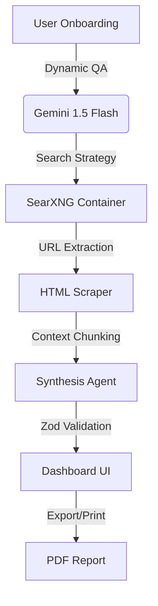

# CareerX: Decentralized AI Career Intelligence Framework

[](https://nextjs.org/)
[](https://ai.google.dev/)
[](https://docs.searxng.org/)
[](https://zod.dev/)
[](https://github.com/darkroomengineering/lenis)

CareerX is a production-grade, state-of-the-art career guidance framework. It utilizes a multi-agent system powered by **Google Gemini 1.5 Flash**, strict **Zod schemas**, and live internet synthesis via **SearXNG** to eliminate LLM hallucinations and provide verified, real-world academic and job market intelligence.

---

## 🚀 Core Features

- **Stateless Architecture**: Zero database. All session data is stored locally via `sessionStorage` ensuring absolute privacy.
- **Adaptive Intelligence**: Dynamic onboarding questionnaires that evolve in real-time based on previous inputs.
- **Decentralized Synthesis**: Validates all career pathways, universities, and salaries against real-time data by scraping up to 10 authoritative sources per query via SearXNG.
- **Deterministic UI**: Enforces strict JSON schemas using the Vercel AI SDK `generateObject`, guaranteeing reliable, type-safe dashboard generation.
- **Cinematic Experience**: Features Framer Motion scroll animations and Lenis smooth scrolling for a premium interface.

---

## 🧠 System Architecture

The application follows a strict Retrieval-Augmented Generation (RAG) pipeline:



---

## ⚙️ Installation & Setup

### Prerequisites
- Node.js 18+
- Docker & Docker Compose (required for SearXNG)
- Google Gemini API Key

### 1. Start the SearXNG Engine
SearXNG runs locally in a Docker container to bypass public instance rate limits and prevent IP bans.
```bash
docker compose up -d
```
*Verify it is running by visiting `http://localhost:8080` in your browser.*

### 2. Environment Configuration
Create a `.env.local` file in the root directory:
```env
GOOGLE_GENERATIVE_AI_API_KEY=your_gemini_api_key_here
SEARXNG_URL=http://127.0.0.1:8080
```

### 3. Install Dependencies & Run
```bash
npm install
npm run dev
```
The application will be available at [http://localhost:3000](http://localhost:3000).

---

## 📊 Evaluation & Ablation Studies

CareerX includes a dedicated evaluation suite inside the `scripts/` directory to measure the efficacy of the RAG pipeline versus a base LLM.

- **`scripts/ablation.ts`**: Runs a comparative test between Condition A (LLM-Only) and Condition B (Full CareerX Pipeline) to measure hallucination rates and source citation quality.
- **`scripts/evaluate.ts`**: Evaluates schema completeness and scraping efficiency across complex personas.

Results of the evaluation are preserved in `evaluation_results_v2.json`.

---

## 🛡️ License & Academic Integrity

This project is part of the CareerX Intelligence Framework research. All web scraping is performed with strict 12-second timeouts and random User-Agents to mimic human requests responsibly. Data is strictly ephemeral and never stored on persistent backends.
