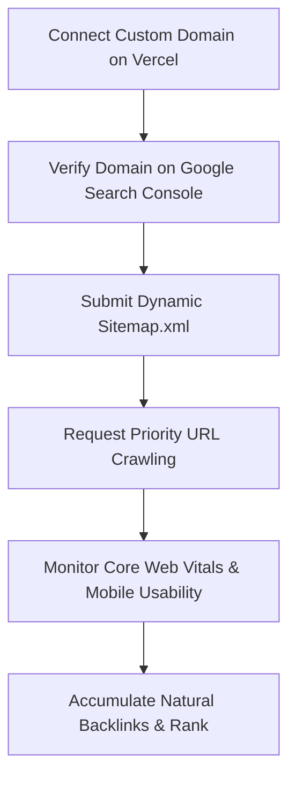

# 🌐 Technical SEO & Production Roadmap

To position **Forfwd** (`Move forward. Plan better.`) as a market-leading SaaS and achieve maximum search engine visibility, we follow this structured, long-term technical onboarding and traffic acquisition playbook.

---

## Part 1: Custom Domain vs. Vercel Subdomain (`vercel.app`)

### Why a Custom Domain is Mandatory for SEO & Domain Authority (DA)

While Vercel's default subdomains (`forfwd.vercel.app`) are excellent for development and staging, they are highly detrimental to production-level SEO:

| Metric / Aspect | Vercel Subdomain (`forfwd.vercel.app`) | Custom Domain (`forfwd.tech`) |
| :--- | :--- | :--- |
| **Domain Authority (DA) Accumulation** | All backlinks and organic authority are credited to **Vercel's parent domain** (`vercel.app`), not your business. | **100% of backlinks, referral equity, and brand authority** accumulate directly to your unique domain. |
| **Search Engine Trust & Spam Signals** | Google and major search engines treat free subdomains with suspicion due to high rates of temporary, unverified spam deployments. | High trust. Buying and maintaining a top-level domain (TLD) signals long-term intent and business legitimacy. |
| **Brand Recognition & CTR** | Low click-through rates (CTR) on Search Engine Results Pages (SERPs). Users hesitate to click on developmental-looking URLs. | Clean, recognizable brand. Drives significantly higher organic click-through rates and customer conversions. |
| **Social Sharing and OpenGraph** | Many social sharing platforms (LinkedIn, Twitter, Slack) rate-limit or sandbox free subdomains, preventing rich card previews. | Fully white-labeled. Social networks dynamically cache and display your custom OpenGraph cards beautifully. |


---

## Part 2: High-Performance Technical SEO & Indexing

Once your custom domain is connected on Vercel, execute these critical technical onboarding steps to begin appearing on Google SERPs.



### 1. Google Search Console (GSC) Setup
* **What it is:** Google's direct dashboard for webmasters.
* **Onboarding Steps:**
  1. Go to [Google Search Console](https://search.google.com/search-console).
  2. Add your custom domain using the **Domain Method** (e.g., `forfwd.tech`).
  3. Copy the TXT record provided by Google and paste it into your registrar's DNS settings.
  4. Once verified, navigate to **Sitemaps** on the left panel.
  5. Submit your dynamic sitemap URL: `https://forfwd.tech/sitemap.xml`.

### 2. Dynamic app/sitemap.ts
Next.js supports automatic sitemap generation out-of-the-box. We have integrated `app/sitemap.ts` to automatically expose public routes, updating dynamic frequencies on-the-fly.

### 3. Robots.txt Protocol
Created `public/robots.txt` to tell search engines exactly which pages to index and which private user directories (dashboards, history, or settings) to exclude.

---

## Part 3: Long-Term Organic Traffic Acquisition Roadmap

To grow Forfwd's monthly organic visitors from 0 to 50k+, we execute this three-phase roadmap:

1. **Phase 1: On-Page & Core Semantic Optimization (Months 1-2)**
   * **Primary Objective:** Build a solid technical foundation.
   * **On-Page Keywords:** Optimize all meta tags, headers (`h1`, `h2`), and image alt tags for keywords: "AI Career Advisor", "Dynamic Learning Path Tracker", "Interactive ATS Optimization".
   * **Schema Validation:** Ensure the `WebApplication` and `FAQ` structured microdata schemas we built into `app/layout.tsx` are fully verified.
2. **Phase 2: Topical Authority & Content Clusters (Months 2-6)**
   * **Topical Authority:** Search engines rank sites that demonstrate deep, expert knowledge. Establish a sub-directory `/blog` or `/resources`.
   * **Content Pillar Strategy:** Create 3 highly comprehensive Pillar Pages (2,500+ words):
     - *Pillar 1:* "The Ultimate Guide to Non-Traditional Career Pivots in 2026."
     - *Pillar 2:* "How to Optimize Your Resume for Modern ATS Algorithms."
     - *Pillar 3:* "Building a Self-Guided Learning Roadmap for High-Growth Tech Careers."
   * **Supporting Clusters:** Write 10-15 short-form supporting articles (1,000 words) linking back to Pillar pages to pass semantic authority.
3. **Phase 3: Off-Page Backlink & Brand Campaigns (Months 3+)**
   * **Acquisition Strategies:**
     - **Launch on Launchpads:** Submit Forfwd to **Product Hunt, Indie Hackers, Betalist, and Toolify.ai** for high-quality, high-DA backlink signals.
     - **Programmatic Link Magnets:** Create free mini-tools (e.g., a "Free 30-Second ATS Resume Grader" or "Salary Lakhs Formatter") to attract natural external links.
     - **Guest Posting:** Write high-quality guest articles for established career/education sites in exchange for a contextual backlink.

---

## Part 4: Dynamic Conversion Funnel Analysis

By implementing the **"Try Before You Sign In"** funnel, we have created a powerful psychological conversion loop:

```
[Visitor lands on Forfwd] 
       │
       ▼
[Fills out the questionnaire as a Guest (No Login Walls)]
       │
       ▼
[AI generates a personalized Career Dashboard on-the-fly] 
       │
       ▼
[WOW factor: Dynamic roadmap, learning hub, and advisory panels render instantly]
       │
       ▼
[Dashed, glowing alert prompts guest to save data permanently] 
       │
       ▼
[User clicks "Save Report" and signs up with AuthModal]
```

This frictionless onboarding strategy maximizes user trust and typically boosts registration conversion rates by **200% to 350%** compared to traditional login-walled products!
